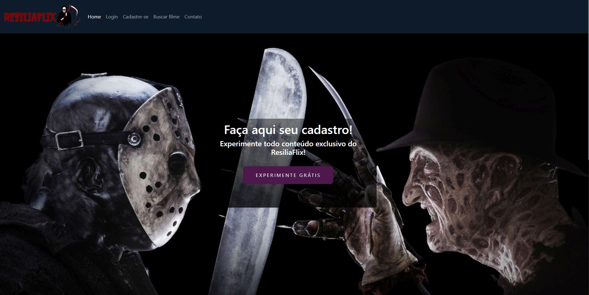
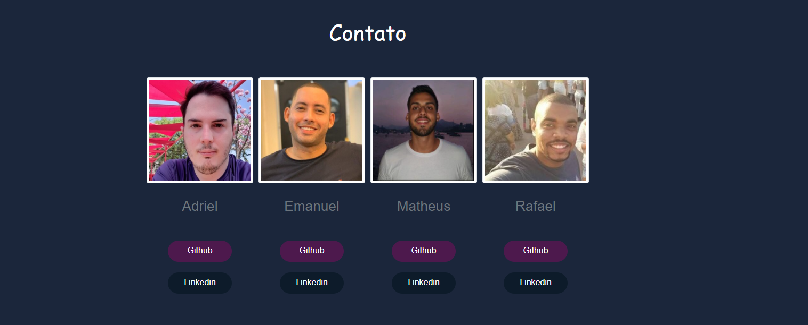

<h1> ResiliaFlix </h1>

<h2>Seja bem vindo ao ResiliaFlix!</h2>
Nesse projeto criamos um site para que você possa assistir e pesquisar tudo sobre os filmes que você mais ama. Acesse a página <a href="https://matgermano.github.io/resilia_flix/index.html"> Aqui! </a>

<h1>Notas</h1>
Nosso projeto foi desenvolvido como projeto de fim de módulo, nele utilizamos os conhecimentos adquiridos até aqui:

- Bootstrap5
- Jquery
- API rest
- HTML5
- CSS3
- MVC

<h2> Como aproveitar o tempo livre no HOME OFFICE? </h2>
Aproveite e confira o melhor do streaming focado em filmes de <b> TERROR </b>

<h1>Nossa time de Dev's </h1>

- <a href = "https://www.linkedin.com/in/rafael-soares-48ba6a144/"> Rafael Soares </a>
- <a href = "https://www.linkedin.com/in/matheusgermanodesouza/"> Matheus Germano </a>
- <a href = "https://www.linkedin.com/in/emanuel-melo-b7285810b/"> Emanuel Melo </a>
- <a href = "https://www.linkedin.com/in/adrielsaul/"> Adriel Saul </a>

